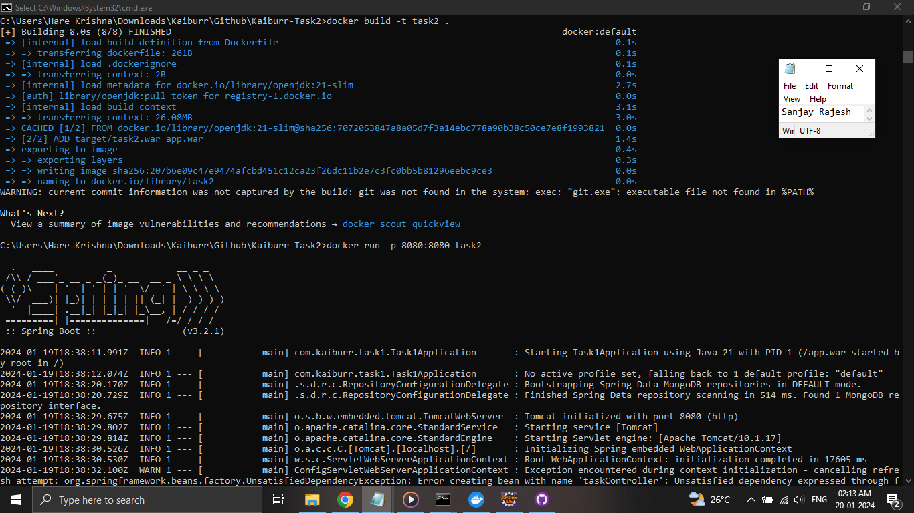
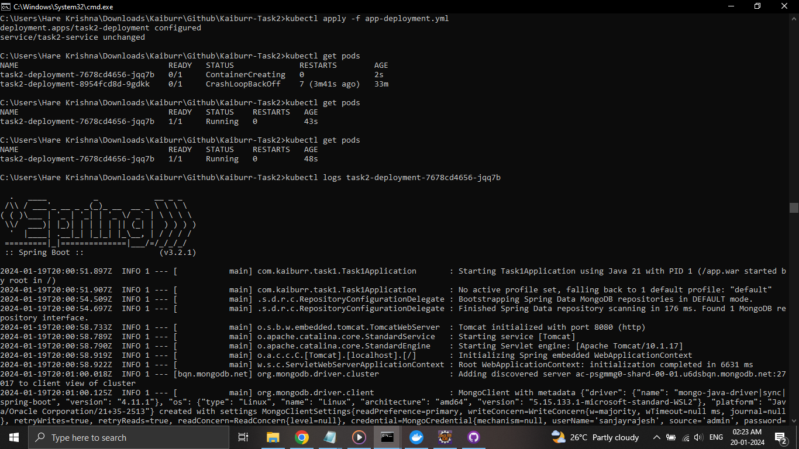
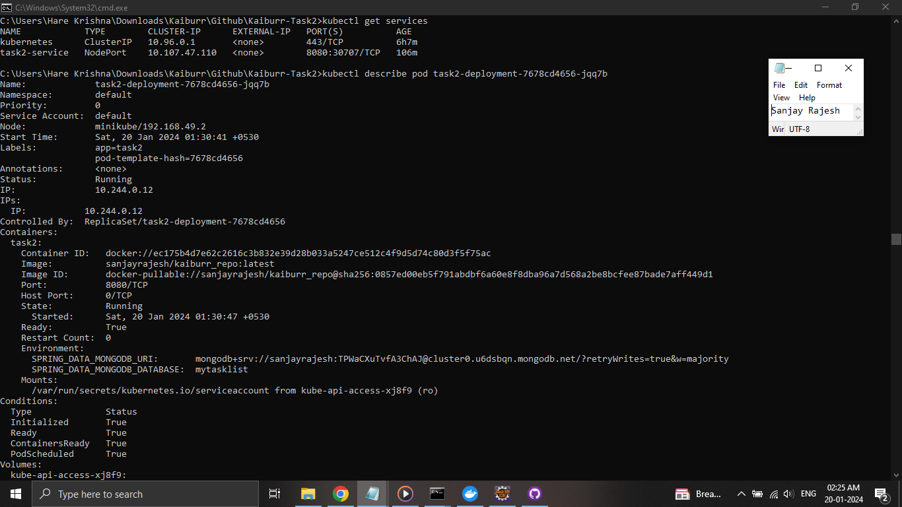
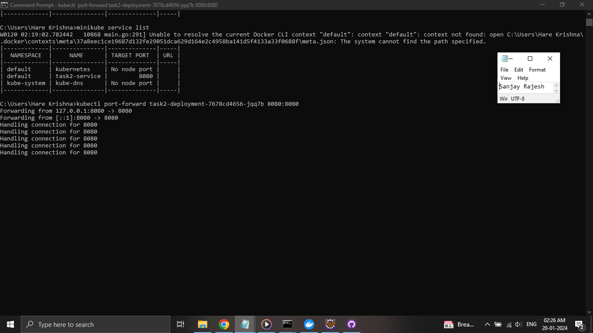
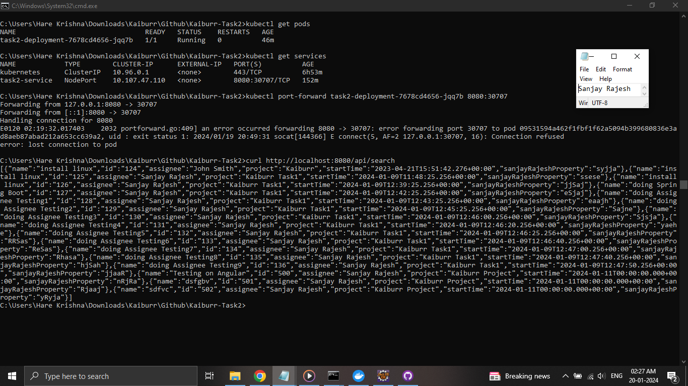

# Kaiburr-Task2
Task 2. Kubernetes

For this task code from Task 1 has been taken as it is. The spring boot app produces a WAR file. So a `Dockerfile` has been created to run this app on port 8080.

The kubernetes yml manifests has been created with a deployment and a service. `Minikube` has been used to create Kubernetes cluster in local system. PLEASE NOTE that since I am using MongoDB Atlas I did not create a persistent volume or a seperate pod.  In the provided Kubernetes manifest, the MongoDB connection details are set as environment variables for the Spring Boot application. So there is no hardcoded values in the code(i.e., within the WAR file).

# Screenshots

Building the docker Image using the Dockerfile.

Deploying the application to the Kubernetes cluster by applying manifest

Details of the Pod created

So inorder to access the app endpoints on my local machine, port-fording is done which will allow the application to be accessed until the port-forwarding process is active.

curl command showing `/api/search` endpoint, that returns all the Tasks created.

# References

[push image to Docker Hub](https://stackoverflow.com/a/44982036)

[kubectl port-forwarding](https://kubernetes.io/docs/tasks/access-application-cluster/port-forward-access-application-cluster/)